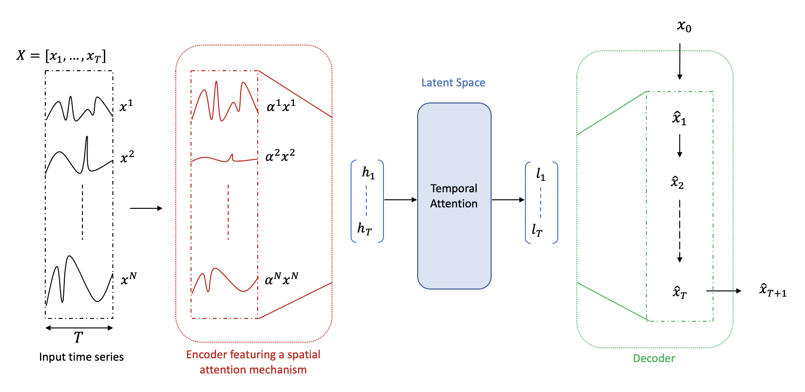

<h1 align="center">LSTM-autoencoder with attentions for multivariate time series</h1>

<p align="center">
    
  
</p>

This repository contains an autoencoder for multivariate time series forecasting.
It features two attention mechanisms described in *[A Dual-Stage Attention-Based Recurrent Neural Network for Time Series Prediction](https://arxiv.org/abs/1704.02971)* and was inspired by [Seanny123's repository](https://github.com/Seanny123/da-rnn).


## Download and dependencies
To clone the repository please run:
```
git clone https://github.com/JulesBelveze/time-series-autoencoder.git
```

To install all the required dependencies please run:
```
pip install -r requirements.txt
```

## Usage
```
python main.py [-h] [--batch-size BATCH_SIZE] [--output-size OUTPUT_SIZE]
               [--label-col LABEL_COL] [--input-att INPUT_ATT]
               [--temporal-att TEMPORAL_ATT] [--seq-len SEQ_LEN]
               [--hidden-size-encoder HIDDEN_SIZE_ENCODER]
               [--hidden-size-decoder HIDDEN_SIZE_DECODER]
               [--reg-factor1 REG_FACTOR1] [--reg-factor2 REG_FACTOR2]
               [--reg1 REG1] [--reg2 REG2] [--denoising DENOISING]
               [--do-train DO_TRAIN] [--do-eval DO_EVAL]
               [--data-path DATA_PATH] [--output-dir OUTPUT_DIR] [--ckpt CKPT]
```
Optional arguments:
```  
  -h, --help            show this help message and exit
  --batch-size BATCH_SIZE
                        batch size
  --output-size OUTPUT_SIZE
                        size of the ouput: default value to 1 for forecasting
  --label-col LABEL_COL
                        name of the target column
  --input-att INPUT_ATT
                        whether or not activate the input attention mechanism
  --temporal-att TEMPORAL_ATT
                        whether or not activate the temporal attention
                        mechanism
  --seq-len SEQ_LEN     window length to use for forecasting
  --hidden-size-encoder HIDDEN_SIZE_ENCODER
                        size of the encoder's hidden states
  --hidden-size-decoder HIDDEN_SIZE_DECODER
                        size of the decoder's hidden states
  --reg-factor1 REG_FACTOR1
                        contribution factor of the L1 regularization if using
                        a sparse autoencoder
  --reg-factor2 REG_FACTOR2
                        contribution factor of the L2 regularization if using
                        a sparse autoencoder
  --reg1 REG1           activate/deactivate L1 regularization
  --reg2 REG2           activate/deactivate L2 regularization
  --denoising DENOISING
                        whether or not to use a denoising autoencoder
  --do-train DO_TRAIN   whether or not to train the model
  --do-eval DO_EVAL     whether or not evaluating the mode
  --data-path DATA_PATH
                        path to data file
  --output-dir OUTPUT_DIR
                        name of folder to output files
  --ckpt CKPT           checkpoint path for evaluation 
  ```
  
  ## Features
  * handles multivariate time series 
  * attention mechanisms
  * denoising autoencoder
  * sparse autoencoder
  
  ## Examples
  You can find under the `examples` scripts to train the model in both cases:
  * reconstruction: the dataset can be found [here](https://gist.github.com/JulesBelveze/99ecdbea62f81ce647b131e7badbb24a)
  * forecasting: the dataset can be found [here](https://gist.github.com/JulesBelveze/e9997b9b0b68101029b461baf698bd72)
  
  
